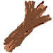
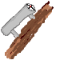
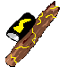
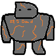
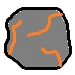
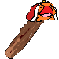

## Dungeon Game

2D roguelike dungeon-crawler for ICS4U final project

### Built With

- [Swing (Java)](https://docs.oracle.com/javase/8/docs/api/index.html?javax/swing/package-summary.html)

**Description**

- Procedurally generated dungeon layout
- Player has a main weapon and a recharging ability
- Each enemy has a 20% chance to drop their own respective item (weapon or ability)
- There are three unique enemies on each floor
- Defeat (10, 15, 20) enemies per floor to advance to next floor
- Enter portal on third floor to win!

### Gameplay

Gameplay snippet from floor 3

### Floors

**Floor 1: Grey Fog**

Ghost

- Fast, explodes into bullets when close

- Drops ability that shoots 8 bullets in all directions

Zombie

- Slow, shoots 3 bullet shotgun

- Drops 3 bullet shotgun stick weapon

Skeleton

- Maintains distance, shoots bow

- Drops sniper stick weapon

**Floor 2: Purple Fog**

Slime

- Slow brute, spawns baby slimes at an interval

- Drops slime juice ability, which heals the player

Wizard

- Maintains distance, randomly shoots 4 different projectiles

- Drops random stick weapon that shoots smaller versions of his projectiles

Minotaur

- Charges player and takes breaks

- Drops minotaur shirt ability which gives player speed boost

**Floor 3: Red Fog**

Imp

- Maintains far distance, shoots paralyzing bullet

- Drops sniper like lightning stick weapon

Golem

- Father of 2, high hp brute, gets close and hauls slow high dmg boulder
- Spawns two children when dead

- Drops ability that hauls giant boulder

Narwhal

- Chases player, stops occasionally and shoots a machine gun at player

- Drops machine gun narwhal stick weapon